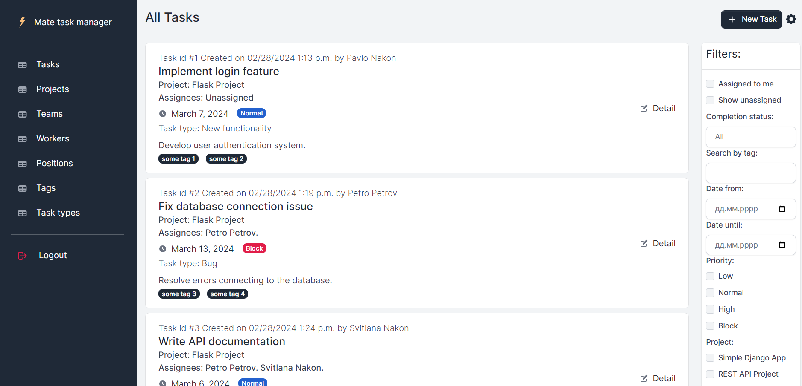

# Task Manager System

Task Manager is a simple yet powerful tool for project and task management. This pet project allows for efficient organization of tasks within different projects and teams.

## Check it out!
Task Manager System deployed to [Render](https://task-manager-system-rkzu.onrender.com/).
Demo credentials: ```demo_username``` / ```Jhsy2837u```
> [!NOTE]
> Free instance in Render will spin down with inactivity, which can delay requests by 50 seconds or more for first request.

## Installation
Python 3 must be already installed

```
git clone https://github.com/pnakongit/task-manager-system.git
cd task-manager-system
python -m venv venv
venv\Scripts\activate (on Windows)
source venv/bin/activate (on macOS)
pip install -r requirements.txt
set DATABASE_URL=<your_link> # set SECRET_KEY to environment variable. <your_key> - your own secret key 
python manage.py migrate
python manage.py createsuperuser
python manage.py runserver
```
Open your browser and navigate to http://127.0.0.1:8000/ to access Task Manager.

## Features 
1. **Project and Team Creation**: Task Manager allows for the creation of separate projects and associating them with respective teams. This allows teams to work on projects separately. 

2. **Multi-team Collaboration on Tasks**: Different teams can work on tasks within a single project. Additionally, one team can work on tasks across multiple projects.

3. **Permission Control**: Task Manager allows for setting permission levels for users. This controls who has access to specific projects and tasks, ensuring security and confidentiality of information.

4. **Automatic Action Logging**: Actions on tasks (create, update, or delete) are automatically logged.  This enables tracking of change history and identification of important events in the workflow.


## Demo

